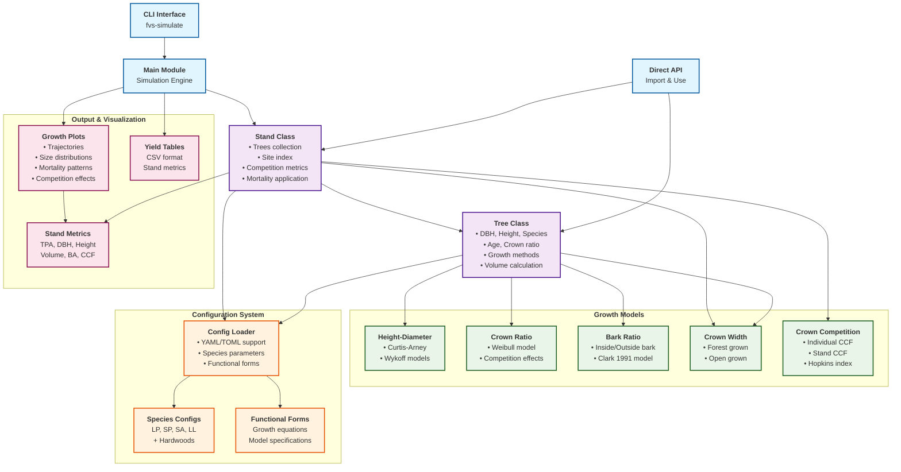
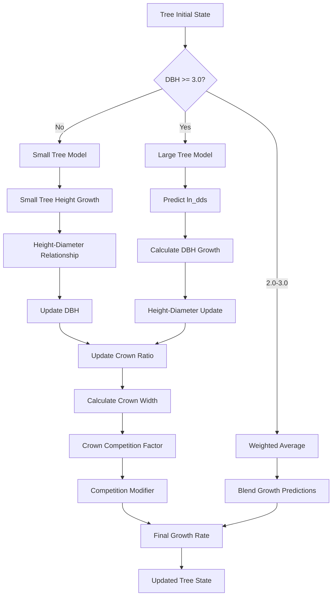

# FVS-Python: Southern Yellow Pine Growth Simulator

## Overview
FVS-Python is a Python implementation of the Southern variant of the Forest Vegetation Simulator (FVS). It simulates the growth and yield of four southern yellow pine species:
- Loblolly Pine (Pinus taeda, LP)
- Shortleaf Pine (Pinus echinata, SP)
- Longleaf Pine (Pinus palustris, LL)
- Slash Pine (Pinus elliottii, SA)

The simulator generates yield tables for planted stands from age 0 to 50 years, using average stand characteristics.

## Project Architecture

### Architecture Overview Diagram



### Individual Tree Growth Model Interactions


## Component Details

### Entry Points (Blue)

#### CLI Interface (`cli.py`)
- **Command**: `fvs-simulate`
- **Functions**: Run simulations, convert configs, validate configurations
- **Usage**: `fvs-simulate run --years 50 --species LP --site-index 70`

#### Main Module (`main.py`)
- **Purpose**: Core simulation engine
- **Functions**: Stand initialization, growth simulation, yield table generation
- **Output**: CSV yield tables, visualization plots

#### Direct API
- **Usage**: Import classes and functions directly in Python code
- **Example**: `from fvs_python import Stand, Tree, create_height_diameter_model`

### Core Classes (Purple)

#### Stand Class (`stand.py`)
- **Manages**: Collection of trees, site conditions
- **Calculates**: Competition metrics, mortality rates, stand-level statistics
- **Methods**: `grow()`, `get_metrics()`, `initialize_planted()`

#### Tree Class (`tree.py`)
- **Attributes**: DBH, height, species, age, crown ratio
- **Methods**: `grow()`, `get_volume()`, height-diameter updates
- **Models**: Blends small-tree and large-tree growth approaches

### Growth Models (Green)

#### Height-Diameter (`height_diameter.py`)
- **Curtis-Arney**: `Height = 4.5 + P2 * exp(-P3 * DBH^P4)`
- **Wykoff**: `Height = 4.5 + exp(B1 + B2 / (DBH + 1))`
- **Features**: Numerical solver for reverse calculations

#### Crown Ratio (`crown_ratio.py`)
- **Model**: Weibull distribution-based
- **Factors**: Competition effects, tree size, stand density
- **Equation**: ACR model with species-specific parameters

#### Bark Ratio (`bark_ratio.py`)
- **Model**: Clark (1991) linear relationship
- **Equation**: `DIB = b1 + b2 * DOB`
- **Purpose**: Convert between inside and outside bark measurements

#### Crown Width (`crown_width.py`)
- **Forest Grown**: Equations for trees in forest conditions
- **Open Grown**: Equations for trees in open conditions
- **Usage**: Competition calculations, CCF computation

#### Crown Competition Factor (`crown_competition_factor.py`)
- **Individual CCF**: Per-tree competition index
- **Stand CCF**: Stand-level competition measure
- **Hopkins Index**: Alternative competition metric

### Configuration System (Orange)

#### Config Loader (`config_loader.py`)
- **Formats**: YAML and TOML support
- **Features**: Unified parameter loading, format conversion
- **Structure**: Species configs, functional forms, site index parameters

#### Species Configurations
- **Pine Species**: LP (Loblolly), SP (Shortleaf), SA (Slash), LL (Longleaf)
- **Hardwoods**: Hickory, elm, cherry, dogwood, tulip tree, etc.
- **Parameters**: Growth coefficients, density limits, volume equations

#### Functional Forms
- **Growth Equations**: Mathematical model specifications
- **Model Types**: Chapman-Richards, ln(DDS), Curtis-Arney, Wykoff
- **Documentation**: Equation sources, variable definitions

### Output & Visualization (Pink)

#### Growth Plots (`growth_plots.py`)
- **Trajectories**: Stand development over time
- **Size Distributions**: DBH and height distributions
- **Mortality Patterns**: Mortality rates by age/size
- **Competition Effects**: CCF and density relationships

#### Yield Tables
- **Format**: CSV files with stand metrics over time
- **Metrics**: TPA, mean DBH, mean height, volume, basal area
- **Time Steps**: Typically 5-year intervals

#### Stand Metrics
- **Basic**: Trees per acre (TPA), mean DBH, mean height
- **Advanced**: Volume, basal area, CCF, relative density
- **Calculations**: Updated each growth cycle

## Data Flow Patterns

### 1. Configuration Flow
```
Config Files → Config Loader → Tree/Stand Classes → Growth Models
```

### 2. Growth Simulation Flow
```
Stand → Trees → Growth Models → Updated Tree Attributes → Stand Metrics
```

### 3. Output Generation Flow
```
Stand Metrics → Visualization Tools → Plots/Tables → File Output
```

## Development Guidelines

- Break down tasks into discrete steps
- Explain your approach and logic in detail
- Ask me for any needed clarifications

### First Principles

1. Version Control is a Must.
2. Keep it Simple, Stupid (KISS).
3. Separation of Concerns.
4. Separate Configuration from Code.
5. You Aren't Gonna Need It (YAGNI).
6. Premature Optimization is the Root of All Evil.
7. Don't Repeat Yourself (DRY).
8. Composability.
9. Test the Critical Bits.
10. Fail Fast and Loudly.

### Configuration
- Use Configuration Files.
- Use environment variables.
- Clearly document all parameters.

### End-to-End Pipeline
- Define the Minimal Pipeline: Identify the essential steps needed to process raw data to a final output and implement them.
- Iterative Development: Start with the most straightforward implementation and iteratively add features, optimizations, and complexity.
- Validate Early: Ensure that each stage of the pipeline works correctly before moving on to the next.
- Simple Tools First: Use simple, well-understood tools and methods initially, and only introduce more advanced techniques when necessary.
- Document the Process: Keep documentation up-to-date with each iteration to ensure the evolving pipeline remains understandable.

## Core Components

### Individual Tree Growth Models

The growth modeling system implements several key equations:

1. **Height-Diameter Relationships**
   - Curtis-Arney equation (primary method)
   - The SN variant will use the Curtis-Arney functional form as shown here:
   ```python
   height = 4.5 + p2 * exp(-p3 * DBH**p4)  # Curtis-Arney for DBH >= 3.0 inches
   height = (4.5 + p2 * exp(-p3 * 3**p4) - 4.51) * (DBH - Dbw) / (3 - Dbw)) + 4.51 # Curtis-Arney for DBH < 3.0 inches
   ```

2. **Bark Ratio Relationships**
   - Bark ratio estimates are used to convert between diameter outside bark and diameter inside bark
   - bark_ratio is bounded between 0.8 and 0.99
   - diameter measured at breast height
   - The bark ratio is calculated using the following functional form:
   ```python
   diameter_inside_bark = bark_ratio_b1 + bark_ratio_b2 * diameter_outside_bark
   bark_ratio = diameter_inside_bark / diameter_outside_bark
   ```

3. **Crown Ratio Relationships**
   - Crown ratio equations are used to estimate initial crown ratios for regenerating trees established during a simulation.
   - Crown ratios for newly established trees during regeneration are estimated using the following equation below.
   - Crown ratio is bounded between 0.2 and 0.9
   - A random component is added to the equation to ensure that not all newly established trees are assigned exactly the same crown ratio.
   ```python
   crown_ratio = 0.89722 - 0.0000461 * crown_competition_factor + small_random_component
   crown_competition_factor = 0.001803 * crown_width**2
   ```

4. **Crown Width Relationships**
   - The SN variant calculates the maximum crown width for each individual tree. 
   - Crown width is used to calculate crown competition factor (CCF). (CCF) within the model. When available, forest-grown maximum crown width equations are used to compute PCC and open-grown maximum crown width equations are used to compute CCF.
   - Crown width for the yellow pine species is estimated using the following functional forms:
   ```python
   crown_width = a1 + (a2 * DBH) + (a3 * DBH**2) + (a4 * crown_ratio) + (a5 * hopkins_index) # for open-grown SA >= 5.0 inches
   crown_width = (a1 + (a2 * 5.0) + (a3 * 5.0**2) + (a4 * crown_ratio) + (a5 * hopkins_index)) * (DBH / 5.0) # for open-grown SA < 5.0 inches
   crown_width = a1 + (a2 * DBH * 2.54) + (a3 * (DBH * 2.54)**2) * 3.28084 # for open-grown LP, SP, LL >= 3.0 inches
   crown_width = (a1 + (a2 * 3.0 * 2.54) + (a3 * (3.0 * 2.54)**2) * 3.28084) * (DBH / 3.0) # for open-grown LP, SP, LL < 3.0 inches
   hopkins_index = (elevation - 887) / 100) * 1.0 + (latitude - 39.54) * 4.0 + (-82.52 - longitude) * 1.25
   ```

5. **Small Tree Growth**
   - The small-tree height growth model predicts periodic potential height growth from height growth curves using the Chapman-Richards nonlinear functional form. 
   - A linear function fills in the height growth curves from 0 at age 0 to the lower end of the height growth curve. 
   - Height growth is computed by subtracting the current predicted height from the predicted height 5 years in the future, as depicted in the following equation.
   ```python
   small_tree_height_growth = c1 * si**c2 * (1.0 - exp(c3 * age))**(c4 * (si**c5))
   age = 1.0/c3 * (log(1.0 - (height / c1 / si**c2)**(1.0 / c4 / si**c5))) # height is tree height in feet
   ```

6. **Small to Large Tree Transition**
   - Height growth estimates from the small-tree model are weighted with the height growth estimates from the large tree model over a range of diameters (Xmin and Xmax) in order to smooth the transition between the two models. 
   - For example, the closer a tree's DBH value is to the minimum diameter (Xmin), the more the growth estimate will be weighted towards the small-tree growth model. 
   - The closer a tree's DBH value is to the maximum diameter (Xmax), the more the growth estimate will be weighted towards the large-tree growth model. 
   - If a tree's DBH value falls outside of the range given by Xmin and Xmax, then the model will use only the small-tree or large-tree growth model in the growth estimate. 
   - Xmin and Xmax vary by species.
   - The weight applied to the growth estimate is given by the following equation:
   ```python
   weight = 0 # if dbh < Xmin
   weight = 1 # if dbh >= Xmax
   weight = (dbh - Xmin) / (Xmax - Xmin) # if Xmin <= dbh <= Xmax
   estimated_height_growth = ((1 - weight) * small_tree_height_growth) + (weight * large_tree_height_growth)
   ```

7. **Large Tree Growth**
   - Trees are considered large when the diameter at breast height (DBH) is greater than or equal to 3.0 inches.
   - The large-tree model is driven by diameter growth meaning diameter growth is estimated first, and then height growth is estimated from diameter growth and other variables.
   - Instead of predicting diameter increment directly, the naturallog of the periodic change in squared inside-bark diameter (ln(DDS)) is predicted
   - The Southern variant predicts 5-year diameter growth using equation:
   ```python
   ln_dds = b1 + b2*log(dbh) + b3*dbh^2 + b4*log(cr) + b5*relative_height + b6*si + b7*basal_area_per_acre + b8*plot_basal_area_for_large_trees + b9*slope + b10*cos(aspect)*slope + b11*sin(aspect)*slope + forest_type_factor + ecounit_factor + planting_factor
   ```

## Species-Specific Parameters

### Growth Coefficients
```python
species_data = {
    'LP': {  # Loblolly Pine
        'p2': 243.860648,
        'p3': 4.28460566,
        'p4': -0.47130185,
        'Dbw': 0.5,
        'bark_ratio_b1': -0.48140,
        'bark_ratio_b2': 0.91413,
        'a1': 0.7380,
        'a2': 0.2450,
        'a3': 0.000809,
        'c1': 1.1421,
        'c2': 1.0042,
        'c3': -0.0374,
        'c4': 0.7632,
        'c5': 0.0358,
        'b1': 0.222214,
        'b2': 1.163040,
        'b3': -0.000863,
        'b4': 0.028483,
        'b5': 0.006935,
        'b6': 0.005018,
        'forest_type_factor': 0.000000,
        'ecounit_factor': 0.000000,
        'planting_factor': 0.245669,
        'Xmin': 1,
        'Xmax': 3
    },
    'SP': {  # Shortleaf Pine
        'p2': 444.0921666,
        'p3': 4.11876312,
        'p4': -0.30617043,
        'Dbw': 0.5,
        'bark_ratio_b1': -0.44121,
        'bark_ratio_b2': 0.93045,
        'a1': 0.5830,
        'a2': 0.2450,
        'a3': 0.0009,
        'c1': 1.4232,
        'c2': 0.9989,
        'c3': -0.0285,
        'c4': 1.2156,
        'c5': 0.0088,
        'b1': -0.008942,
        'b2': 1.238170,
        'b3': -0.001170,
        'b4': 0.053076,
        'b5': 0.040334,
        'b6': 0.004723,
        'forest_type_factor': 0.000000,
        'ecounit_factor': -0.265699,
        'planting_factor': 0.000000,
        'Xmin': 1,
        'Xmax': 3
    },
    'LL': {  # Longleaf Pine
        'p2': 98.56082813,
        'p3': 3.89930709,
        'p4': -0.86730393,
        'Dbw': 0.5,
        'bark_ratio_b1': -0.45903,
        'bark_ratio_b2': 0.92746,
        'a1': 0.113,
        'a2': 0.259,
        'a3': 0.0000001,
        'c1': 1.1421,
        'c2': 0.9947,
        'c3': -0.0269,
        'c4': 1.1344,
        'c5': -0.0109,
        'b1': -1.331052,
        'b2': 1.098112,
        'b3': -0.001834,
        'b4': 0.184512,
        'b5': 0.388018,
        'b6': 0.008774,
        'forest_type_factor': 0.000000,
        'ecounit_factor': 0.000000,
        'planting_factor': 0.110751,
        'Xmin': 1,
        'Xmax': 3
    },
    'SA': {  # Slash Pine
        'p2': 1087.101439,
        'p3': 5.10450596,
        'p4': -0.24284896,
        'Dbw': 0.5,
        'bark_ratio_b1': -0.55073,
        'bark_ratio_b2': 0.91887,
        'a1': -6.9659,
        'a2': 2.1192,
        'a3': -0.0333,
        'a4': 0.0587,
        'a5': -0.0959,
        'c1': 1.1557,
        'c2': 1.0031,
        'c3': -0.0408,
        'c4': 0.9807,
        'c5': 0.0314,
        'b1': -1.641698,
        'b2': 1.461093,
        'b3': -0.002530,
        'b4': 0.265872,
        'b5': 0.069104,
        'b6': 0.006851,
        'forest_type_factor': 0.000000,
        'ecounit_factor': 0.000000,
        'planting_factor': 0.227572,
        'Xmin': 1,
        'Xmax': 3
    }
}
```

### Typical Stand Characteristics
| Species | Initial TPA |
|---------|-------------|
| Loblolly | 500-700 |
| Shortleaf | 400-600 |
| Longleaf | 300-500 |
| Slash | 450-650 |

## Stand Simulation Process

### 1. Stand Initialization
```python
def initialize_planted_stand(species, tpa, site_index):
    """Initialize a planted pine stand.
    
    Args:
        species: Species code ('LP', 'SP', 'LL', 'SA')
        tpa: Trees per acre at planting
        site_index: Site index (base age 25)
    """
    stand = Stand()
    
    # Set initial tree attributes
    dbh_mean = 0.5  # inches at age 0
    dbh_sd = 0.1    # standard deviation
    
    # Generate initial tree list with random variation
    for _ in range(tpa):
        dbh = random.gauss(dbh_mean, dbh_sd)
        height = 1.0  # feet at age 0
        stand.add_tree(Tree(
            species=species,
            dbh=max(0.1, dbh),
            height=height,
            expansion_factor=1.0
        ))
    
    stand.site_index = site_index
    return stand
```

### 2. Growth Simulation
```python
def simulate_stand_growth(stand, end_age=50, timestep=5):
    """Simulate stand growth from age 0 to end_age.
    
    Args:
        stand: Initialized Stand object
        end_age: Final simulation age
        timestep: Years between calculations
    
    Returns:
        List of stand conditions at each timestep
    """
    results = []
    
    for age in range(0, end_age + 1, timestep):
        # Calculate competition
        stand.update_competition()
        
        # Grow trees
        for tree in stand.trees:
            # Height growth
            potential_height = potential_height_growth(
                tree, stand.site_index, age)
            modifier = competition_modifier(tree, stand)
            tree.height += potential_height * modifier
            
            # Diameter growth
            tree.dbh += calculate_diameter_growth(tree, stand)
        
        # Apply mortality
        stand.apply_mortality()
        
        # Calculate stand metrics
        metrics = {
            'age': age,
            'tpa': len(stand.trees),
            'ba_per_acre': calculate_basal_area(stand.trees),
            'volume_per_acre': calculate_volume(stand),
            'qmd': calculate_quadratic_mean_diameter(stand.trees),
            'dominant_height': calculate_dominant_height(stand)
        }
        
        results.append(metrics)
    
    return results
```

### 3. Yield Table Generation
```python
def generate_yield_table(species, site_classes, tpa_range):
    """Generate yield tables for different site classes and planting densities.
    
    Args:
        species: Species code
        site_classes: List of site index values to simulate
        tpa_range: List of initial trees per acre values
    
    Returns:
        DataFrame with yield table results
    """
    results = []
    
    for site_index in site_classes:
        for initial_tpa in tpa_range:
            # Initialize stand
            stand = initialize_planted_stand(
                species=species,
                tpa=initial_tpa,
                site_index=site_index
            )
            
            # Run simulation
            growth_results = simulate_stand_growth(stand)
            
            # Add to results
            for period in growth_results:
                period.update({
                    'species': species,
                    'site_index': site_index,
                    'initial_tpa': initial_tpa
                })
                results.append(period)
    
    return pd.DataFrame(results)
```

## Key Features

### Scientific Integrity
- **Source of Truth**: Growth coefficients stored in configuration files
- **Traceability**: All parameters traceable to FVS documentation
- **Validation**: Configuration validation tools included

### Flexibility
- **Multiple Species**: Support for pines and hardwoods
- **Model Selection**: Choose between different height-diameter models
- **Time Steps**: Configurable simulation periods

### Extensibility
- **Modular Design**: Easy to add new species or models
- **Plugin Architecture**: Growth models as separate modules
- **Configuration System**: External parameter management

## Usage Examples

### Command Line
```bash
# Basic simulation
fvs-simulate run

# Custom parameters
fvs-simulate run --years 40 --species LP --site-index 80 --trees-per-acre 600

# Configuration management
fvs-simulate convert-config --output-dir ./cfg/toml
fvs-simulate validate-config
```

### Python API
```python
from fvs_python import Stand, Tree

# Create a planted stand
stand = Stand.initialize_planted(trees_per_acre=500, site_index=70)

# Run simulation
stand.grow(years=50)

# Get results
metrics = stand.get_metrics()
print(f"Final volume: {metrics['volume']} cubic feet/acre")
```

### Direct Module Usage
```bash
python -m src.main
```

This will:
1. Initialize a planted stand
2. Simulate growth for 50 years
3. Generate yield table and plots
4. Display summary statistics

## File Structure

```
src/fvs_python/
├── __init__.py              # Package exports
├── tree.py                  # Tree class
├── stand.py                 # Stand class
├── main.py                  # Simulation engine
├── cli.py                   # Command-line interface
├── config_loader.py         # Configuration system
├── height_diameter.py       # Height-diameter models
├── crown_ratio.py           # Crown ratio models
├── bark_ratio.py            # Bark ratio models
├── crown_width.py           # Crown width models
├── crown_competition_factor.py  # CCF models
├── growth_plots.py          # Visualization tools
└── parameters.py            # Parameter definitions
```

## Configuration

All growth parameters are defined in `cfg/species/lp_loblolly_pine.yaml` and related configuration files:
- Height-diameter relationships
- Crown and bark parameters
- Growth model coefficients
- Mortality parameters
- Stand initialization values

## Dependencies

- **Core**: Python 3.8+, NumPy, Pandas, SciPy
- **Visualization**: Matplotlib
- **Configuration**: PyYAML, tomli/tomllib, tomli-w
- **Validation**: Pydantic
- **Testing**: pytest, pytest-cov

## Documentation

- **[Getting Started Guide](docs/getting_started.md)** - Installation and first simulation
- **[Contributing Guide](CONTRIBUTING.md)** - Development setup and guidelines
- **[CLAUDE.md](CLAUDE.md)** - Architecture details and known issues
- **[API Reference](docs/api/index.rst)** - Module documentation (build with Sphinx)
- **[Validation Spec](docs/FVS_PYTHON_VALIDATION_SPEC.md)** - Testing and validation requirements

### Building API Documentation

```bash
# Install docs dependencies
uv pip install -e ".[docs]"

# Build HTML documentation
cd docs && make html

# Open in browser
open _build/html/index.html
```

---

*This documentation reflects the current state of the FVS-Python project and serves as a comprehensive guide for understanding the codebase structure, data flow patterns, and usage.*
